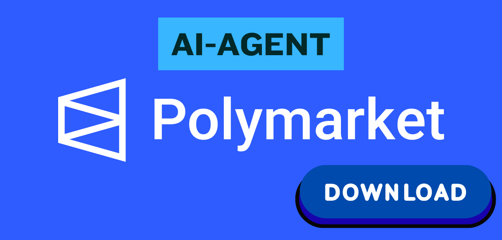

# 🤖 Polymarket AI Copy Trading & Prediction Bot

**Autonomous AI-driven trading system for Polymarket — combining market data, mathematical models, and advanced language models (LLMs) for real-time prediction and execution.**

<div align="center">
  <a href="../../releases/latest">
    
  </a>
</div>

---

## 🧠 Overview

**Polymarket AI Trader** is an autonomous trading agent that monitors market trends, predicts event outcomes, and executes trades on the Polymarket platform.
Powered by **AI models (ChatGPT, DeepSeek, Claude, Gemini, Grok)** and quantitative finance algorithms, it merges **machine reasoning**, **expected value analysis**, and **Kelly criterion** to maximize long-term profit potential.

Unlike human traders who rely on emotions or hype, this system continuously **scans**, **analyzes**, and **acts** with full automation — from data collection to position management.

---

## 🌟 Core Features

* ✅ **Real-Time Wallet Tracking**
  Monitor target wallets and mirror their trades in milliseconds.

* ✅ **AI-Powered Market Analysis**
  Use multiple LLMs (ChatGPT, DeepSeek, Claude, Gemini, Grok) for real-time sentiment parsing, news classification, and event probability estimation.

* ✅ **Automated Copy Trading**
  Replicate trading strategies of selected high-performing accounts automatically.

* ✅ **Mathematical Decision Engine**
  Calculate **Expected Value (EV)** and use **Kelly Criterion** to determine optimal bet sizes and capital allocation.

* ✅ **Polymarket Scanner**
  Continuously searches for **mispriced events**, identifies **market inefficiencies**, and calculates **true probabilities** based on historical and live data.

* ✅ **Volatility Modeling**
  Downloads and analyzes historical data for major assets (ETH, BTC, SOL) to predict directional deviations and assess market bias.

* ✅ **Flexible Strategy Modes**
  Support for **Scale** (proportional) and **Allocate** (fixed capital) copy modes.

* ✅ **Event-Driven Architecture**
  Built on async message queues for **low latency** and **high throughput** execution.

* ✅ **Risk Management**
  Includes minimum bet thresholds, retry mechanisms, trade logging, and performance tracking.

* ✅ **Multi-Interface Control**
  Manage and monitor the bot through:

  * Command-Line Interface (CLI)
  * FastAPI REST API
  * Telegram Bot

---

## ⚙️ System Architecture

```text
+------------------------+
| Polymarket API / Data  |
+-----------+------------+
            |
     Historical & Live Data
            |
+-----------v------------+
|  AI Analysis Layer     | ← ChatGPT / DeepSeek / Claude / Gemini / Grok
|  • Event parsing       |
|  • Sentiment analysis  |
|  • Probability scoring |
+-----------+------------+
            |
    Mathematical Engine
( EV + Kelly Criterion )
            |
+-----------v------------+
|  Trade Executor        |
|  • Market / Limit      |
|  • Copy / Auto scaling |
+-----------+------------+
            |
   API → Wallet → Trade
```

---

## 📊 Example Use Case

1. The bot detects a new **ETH > $4000 before June** event on Polymarket.
2. It fetches **historical volatility** for ETH and estimates a **47.5% probability**.
3. The market currently prices it at **38%**, giving a **+9.5% EV advantage**.
4. Using **Kelly Criterion**, it allocates **2.8%** of capital.
5. The bot automatically **places a bid**, monitors outcome, and **sells in profit** on volatility spikes.

---

## 🧩 Tech Stack

| Layer         | Technology                                  |
| :------------ | :------------------------------------------ |
| Core Language | **Python 3.13+**                            |
| Framework     | FastAPI, asyncio, pydantic                  |
| AI Models     | ChatGPT / DeepSeek / Gemini / Grok / Claude |
| Data          | Polymarket API, WebSocket feeds             |
| DB (optional) | PostgreSQL                                  |
| Messaging     | Redis / Async Queue                         |
| Interface     | CLI / REST / Telegram                       |
| Reports       | Pandas, Matplotlib, HTML/PDF generation     |

---

## 🚀 Quick Start


---

## 📈 Strategy Insights

* **Expected Value (EV):**
  Calculates the difference between the market-implied probability and the AI-estimated true probability.

* **Kelly Criterion:**
  Determines optimal bet size to maximize long-term growth while minimizing risk of ruin.

* **Behavioral Exploitation:**
  Many traders place emotional or yield-farming positions on long-term events — the AI system identifies and exploits these inefficiencies.

---

## 🧠 AI Integration Layer

Each model specializes in a different analytical dimension:

| Model        | Focus                                         |
| :----------- | :-------------------------------------------- |
| **ChatGPT**  | Structured reasoning, probability explanation |
| **DeepSeek** | Pattern discovery, hidden correlations        |
| **Claude**   | Contextual market summaries                   |
| **Gemini**   | Financial text classification                 |
| **Grok**     | News sentiment and sarcasm detection          |

The bot fuses these perspectives into a **unified prediction score**, weighting each by its past accuracy.

---

## 🔒 Risk & Control

* Minimum trade amount filter
* Max loss per event
* Stop-trade cooldown after consecutive losses
* Automatic retry with exponential backoff
* Full logging and trade journal export

---

## 🔍 SEO Keywords

Polymarket AI Trading Bot, Polymarket Copy Trading Bot, Polymarket AI Trader, Polymarket Trading Automation, Polymarket Prediction Market Bot, Polymarket Arbitrage Bot, Polymarket Quantitative Trading System, Polymarket GPT-based Trader, Polymarket LLM Trading Bot, Polymarket DeepSeek AI Integration, Polymarket Claude AI Trading, Polymarket Gemini AI Trader, Polymarket Grok AI Trading Engine, Polymarket Multi-Model Trading System, Polymarket Automated Strategy Builder, Polymarket Market Analyzer, Polymarket AI Prediction Engine, Polymarket EV Calculator, Polymarket Kelly Criterion Bot, Polymarket Expected Value Trader, Polymarket Statistical Trading AI, Polymarket Sentiment Analyzer, Polymarket News Parser AI, Polymarket Signal Bot, Polymarket Portfolio Optimizer, Polymarket Risk Management AI, Polymarket Profit Tracker, Polymarket Backtesting Engine, Polymarket Day Trading AI, Polymarket Swing Trading System, Polymarket Volatility Modeler, Polymarket Event Scanner, Polymarket Smart Order Executor, Polymarket Quant Research Bot, Polymarket Autonomous Trading Agent, Polymarket AI Trading Framework, Polymarket Local AI Trader, Polymarket DeepSeek Integration Framework, Polymarket GPT Strategy Engine, Polymarket AI Scalping Bot, Polymarket Market Making AI, Polymarket Statistical Arbitrage System, Polymarket Predictive Analytics AI, Polymarket Real-Time Trading Bot, Polymarket AI Liquidity Farming, Polymarket Data Analysis Engine, Polymarket Auto Bid Bot, Polymarket Profit Optimization AI, Polymarket Multi-Agent Trading System, Polymarket AI Quant Research Tool, Polymarket LLM Market Predictor, Polymarket News Sentiment Bot, Polymarket AI Forecast Engine, Polymarket AI Decision Maker, Polymarket Probability Modeler, Polymarket Copy Trader AI, Polymarket AI Portfolio Manager, Polymarket Event Probability Predictor, Polymarket Crypto Prediction Bot, Polymarket Autonomous AI Trader, Polymarket Multi-LLM Trading Framework, Polymarket Risk Control Engine, Polymarket Strategy Builder AI, Polymarket Quant Analyzer, Polymarket Prediction Market AI Framework, Polymarket AI Integration Layer, Polymarket Quant Signal Generator, Polymarket Backtesting Environment, Polymarket LLM Quant Assistant, Polymarket AI Trade Executor, Polymarket AI Research Agent, Polymarket Quant Intelligence Engine.

---

## 📄 License

Released under the [MIT License](LICENSE).

---

## ⚖️ Disclaimer

This software is provided **for educational and research purposes only**.
Use it at your own risk — the author is **not responsible for any financial losses** or incorrect trading decisions.

> * Cryptocurrency trading involves significant risk.
> * Past performance does not guarantee future results.
> * Only trade with capital you can afford to lose.
> * Always understand market rules and volatility before trading.

---

**🚀 Empower your trading with AI.
Trade smarter. Predict deeper. Act faster.**
